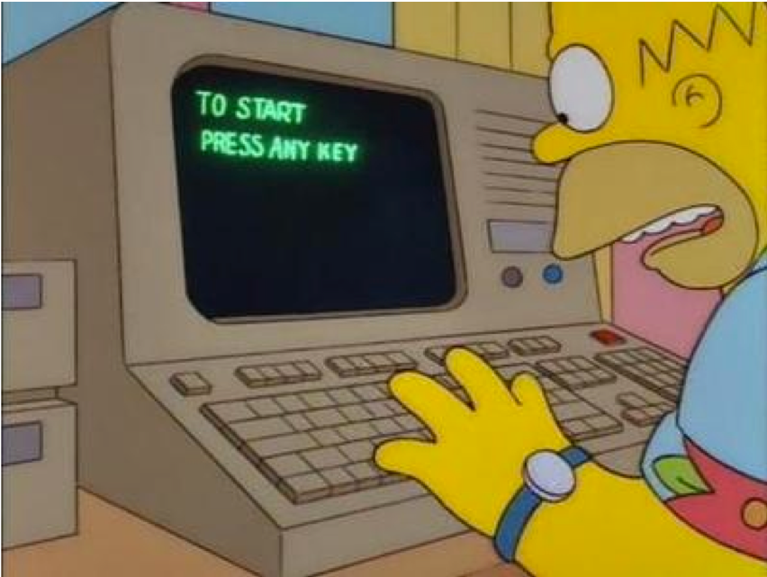
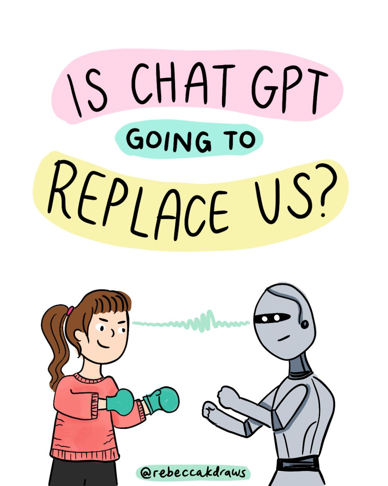

# AI Automation Essentials

### for Business Professionals

Elephant Scale

---

## Pre-requisites and Expectations

* Comfort using a web browser and everyday office software

* **No coding required** — and none will sneak in

  - Everything happens in the browser
  - Bring your accounts, or use the ones we provide in class

* Curiosity!

  - Ask a lot of questions

* This is an "AI Automation Essentials" class
  - No previous AI experience is assumed (but may be helpful)
  - Class will be based on the pace of the majority of the students

Notes:

---
## Our Teaching Philosophy

* Emphasis on concepts & fundamentals

* Browser tools - no need to learn anything by heart

* Highly interactive (questions and discussions are welcome)

* Hands-on (learn by doing)

Notes:

---

## Lots of Labs: Learn By Doing

* Where is the ANY key?

Notes:

---

## Analogy: Learning To Fly...

---

## Introductions

Notes:

---

## + Flight Time

---

## This Will Take A Lot Of Practice

---
## About You And Me

* About Instructor
* About you
  - Your Name
  - Your role (sales, marketing, analyst, ops, manager, ...)
  - Tools you use every day
  - Familiarity with AI so far (scale of 1 - 4 ;  1 - new,   4 - I use it daily)
  - Something non-technical about you! (favorite ice cream flavor / hobby...)

 &nbsp; &nbsp; &nbsp;

---

## Why is this class different
* Before
  * We used to teach tools you had to code against
  * Students enjoyed the show but did not become magicians
* Now
  * We teach AI **automation** — wiring AI into real workflows
  * You leave having *built* something, no code required

---

# AI Will Not Take My Job

---

## The Two-Day Map

| Day | Module | You go from... |
|-----|--------|----------------|
| 1 | 1 — Foundations of Generative AI | mental model + AI vs. rules-based |
| 1 | 2 — Prompt Engineering for Automation | prompts that feed downstream tools |
| 1 | 3 — Evaluating & Troubleshooting | judge and fix AI output |
| 2 | 4 — No-Code Automation & AI Agents | wire AI into a real workflow |
| 2 | 5 — AI for Decisions & Insights | summarize, analyze, decide |
| 2 | 6 — Responsible AI & Governance | ethics, privacy, EU AI Act / NIST |
| 2 | 7 — ROI, Adoption & Capstone | build it, prove the ROI, present it |

In every module you build a real artifact you can take back to work.

---

## Ground Rules

* Use **classroom-approved accounts and data** only.
* **Do not upload confidential information** unless the environment is explicitly approved for it.
* **Verify important facts** before you act on them — the model can be confidently wrong.
* Keep a **human approval step** in any workflow that sends, publishes, deletes, or buys.

Notes:
These four habits separate a useful AI habit from an expensive mistake. We make them second nature starting with Lab 01.
