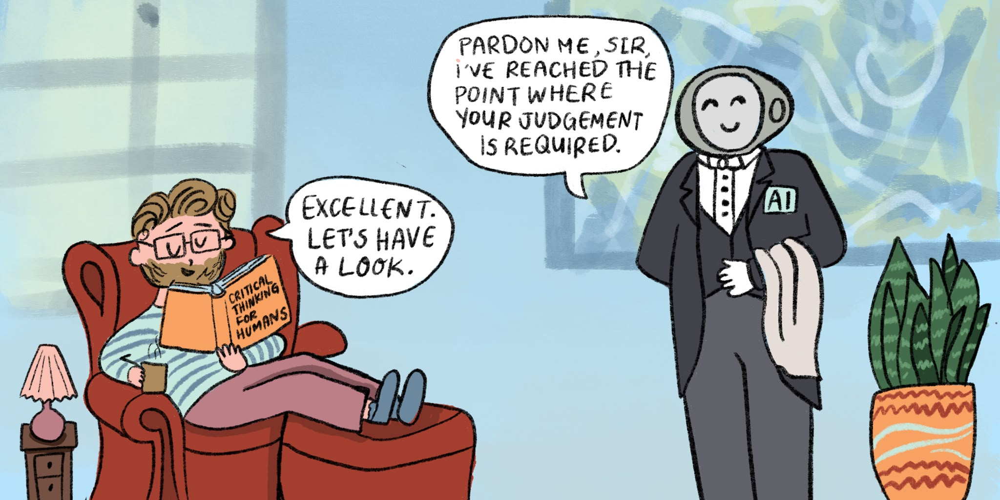

# Foundations of Generative AI in Business

Elephant Scale

---

## Why This Module

* Grounded opinion

* From chat to workflows

* Mental model for the rest of the course

* Where AI fits in automation

> Product names change. The mental model is the durable part.

---

## What Generative AI Is

* Creates new content from instructions

* Works in plain language

* Drafts, summarizes, extracts, classifies

* One tool, many roles

> A flexible drafting and analysis assistant - powerful, but not automatically correct.


---

## What Generative AI Is NOT

* Not a fact database
* Not a calculator
* Not company-aware by default
* Not automatically current
* Not the decision-maker

> Most AI disappointments come from expecting one of these.

---

## How a Language Model Works, in Plain Language

* Predicts the next piece of text
* Pattern completion, not lookup
* Fluent output
* Confident errors
* Context matters
* Specific instructions matter

> It sounds informed before it is grounded.

---

## Key Terms — Without the Jargon (1 of 2)

* Model
* Prompt
* Context
* Tokens

> Context is what the model can see.


---

## Key Terms — Without the Jargon (2 of 2)

* Hallucination
* Bias
* Tool use
* Agent

> These terms explain the rest of the course.

---

## Multimodal AI — Beyond Text

* Documents and PDFs
* Spreadsheets and CSVs
* Screenshots and photos
* Charts and diagrams
* Audio and video

> The file can be the prompt.

---

## The Other Half — Rules-Based Automation

* If-this-then-that logic

* Email filters
* Spreadsheet formulas
* Workflow tools
* Approval chains

> Rules are not obsolete. They are part of the automation stack.


---

## Generative AI vs. Rules-Based Automation

* Core difference: **rules follow a script; AI interprets messy language.**

```text
                    RULES-BASED                 GENERATIVE AI
Input needed        exact signal                 messy language is OK
Output              same every time              can vary run to run
Best at             stable, repeatable logic     interpretation and drafts
Fails by            missing the new case         sounding right when wrong
```

* They fail in **opposite** directions — so they pair well.

> Use rules for stable signals. Use AI for messy language. Review the exceptions.

---

## Worked Example — The Same Task, Two Ways

* Task: route support requests

* Sample data: `lab01-routing-requests.csv`

* Approach A: rules

```text
IF request contains "invoice", "payment", or "refund"  → Finance
IF request contains "login", "password", or "account"  → Account Support
IF request contains "demo", "pricing", or "quote"      → Sales
IF request contains "bug", "error", or "crash"         → Technical Support
ELSE                                                    → General
```

* Approach B: AI interpretation

```text
Route by meaning, not just keywords.
```

> Same task. Different automation behavior.

---

## What Happens on the Real Rows

* Expected keywords

```text
Row  Request (abbreviated)              Rules-based result       AI result
1    "invoice... duplicate payment"     Finance ✓                Finance ✓
2    "can't get into my workspace"      General (no keyword)     Account Support ✓
3    "options for 50 users"             General (no keyword)     Sales ✓
4    "crash when I export"              Technical Support ✓      Technical Support ✓
5    "send a quote"                     Sales ✓                  Sales ✓
6    "set up AI to summarize reports"   General (no keyword)     Implementation Help ✓
```

* Missing keywords

* Clear intent

> Rules handle stable signals. AI handles messy language.
---

## Why You Combine Them

* Rules first

```text
NEW REQUEST
   │
   ▼
[ RULES ]  Does it contain obvious routing keywords?
   ├── YES → route to the matching queue
   └── NO  → hand to the AI step
                 │
                 ▼
             [ AI ]  Read intent → category, priority, summary, draft reply
                 │
                 ▼
             [ RULES ]  IF priority = "urgent"  → notify on-call
                        IF review flag = "yes"  → human review queue
                        ELSE                     → log and draft
```

* AI for interpretation

* Rules and humans for control

> You will build this shape again in Module 4.

---

## The 2026 Landscape — Assistants As Workbenches

* Reasoning modes
* File upload
* Data analysis
* Image understanding
* Project context
* Connectors and apps

> This class uses ChatGPT Enterprise in the VM.

---

## The Rise of AI Agents

* Assistant
* Tool use
* Automation
* Agent

> From answering to acting.


---

## Common Myths — In Both Directions

* Always right

* Already knows your business

* Replaces the whole team

* Just hype

> The realistic view is more useful than either myth.

---

## What AI Is Genuinely Good At

* Drafting
* Summarizing
* Rewriting
* Extracting structure
* Classifying and routing
* Explaining
* Comparing options

> Language-heavy work with fast review loops.

---

## What AI Is Weak At — and Needs Review

* Fresh facts
* Exact arithmetic
* Citations and sources
* Private facts not provided
* Legal, medical, financial advice
* Consequential actions

> Higher consequence = stronger verification.

---

## Intro to AI Operations for Business Leaders

* Where does it fit?
* What data is allowed?
* Who reviews the output?
* How do we know it is working?
* What are the guardrails?

> AI at work is an operating model, not a demo.

---

## Safety Habits — Starting Today

* Approved accounts and data
* No confidential material in public tools
* Ask for assumptions and uncertainties
* Verify before reuse
* Human in the loop

> Good habits are cheap now and expensive later.


---

## Module Review — Your Turn

> **Spot three workflows in your own department where AI could add real value.**

* Task

* Fit

* Review point

> Keep this list for the capstone.


---

## Foundations — Cheat Sheet

* Generative AI
* Core terms
* Rules vs AI
* Assistants and agents
* Good fits and weak spots
* Operating model

> Fast drafting and analysis; human judgment still owns the outcome.

---

## Lab 01 - Rules Automation vs AI Interpretation

**Stop here and run Lab 01.**

You will:

1. Open `labs/assets/lab01-routing-requests.csv`.
2. Ask ChatGPT to simulate a **rules engine** using exact keyword rules.
3. Ask ChatGPT to route the same six requests as an **AI assistant** that reads meaning.
4. Compare the two tables and note where rules were sufficient vs where AI added value.
5. Write one sentence describing a hybrid workflow.

**Deliverable:** rules-engine table, AI routing table, comparison table, and one hybrid
workflow sentence.

**Time:** ~35-45 min.
